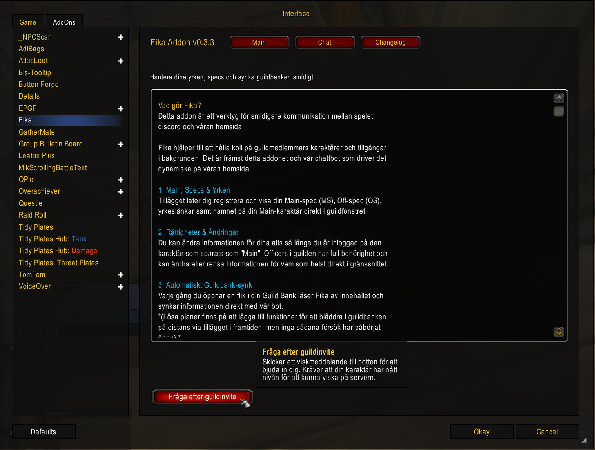
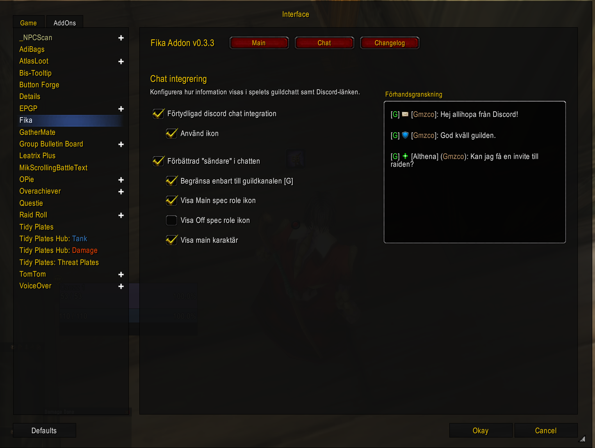
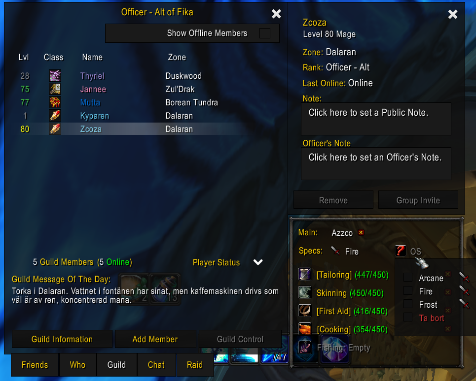

## Självinvit
Med addonet kan du bjuda in dig själv till gillet, förutsatt att du kan skicka ett whisper. Öppna addon inställningarna antingen med `Esc - Interface - Addons - Fika` eller med chatt kommandot `/fika` och tryck på "Fråga efter guildinvite" knappen.

## Chatt inställningar

Du kan också ändra lite hur chatten ska se ut, om du vill se gillemedlemmars roller utanför guildchatt eller liknande; föärhoppningsvis är inställningarna väldigt självförklarande. Rutan till höger ger ett humm om hur det kan se ut i olika situationer:

- Medellande ifrån discord in i guildchat.
- Medellande i guildchatt,
- Medellande utanför guildchatten.

## Uttökad Guild Member Details

Addonets stora uppgift är att förse hemsidan med information om tradeskill länkar, specs opch relationer main/alt. Detta kan man fylla i genom att välja sin karaktär i guild listan.

- **Main**: Här efterfrågas din huvudkaraktärsnamn.

    Förutom att du flaggar vem som är din huvudkaraktär så ger du också tillåtelse för den karaktären att ändra din information. Exempelvis, Zcoza sätter Azzco som main. Azzco kan gå in och justera Zcoza's information men inte vice versa.
- **Specs**: Dropdown lista på specs, välj ditt primära spec och om du skaffat dual spec kan du även ange ditt offspec.

   Saknar du någon kombination av spec/roll får du gärna höra av dig. Förhoppningsvis är de flesta täckta men det kanske finns något mindre uppenbart som trillat mellan stolarna. Unrelenting Assault (Arms Tank) eller liknande spec är det som framförallt kan trillat mellan stolarna.

- **Tradeskill länkar**: Två pirmära och tre sekundära tradeskills kan man ange länkar/nivå för.

    Om du inte kan öppna tradeskill fönstret och generera en länk med fokus på ett av dessa fälten så kan du behöva temporärt skicka länken i typ ett whisper till dig själv och sedan shift-klicka in det här.

    För de professions som saknar länkar kan man ange numerisk nivå. Exempelvis med maxad mining kan man fylla u `M 450/450`.

    Det finns lite alias för de som inte kan generar länkar:

    - M, Mine, Mining `M 450/450`
    - S, Skin, Skining `S 450/450`
    - H, Herb, Herbalism `H 450/450`
    - F, Fish, Fishing. `F 450/450`

